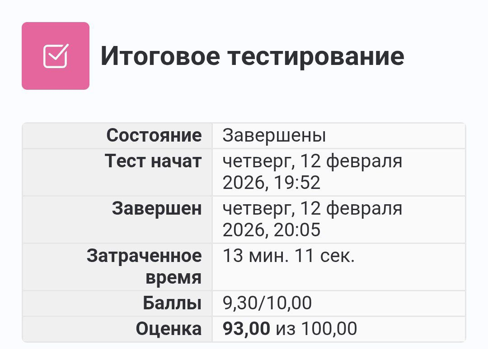
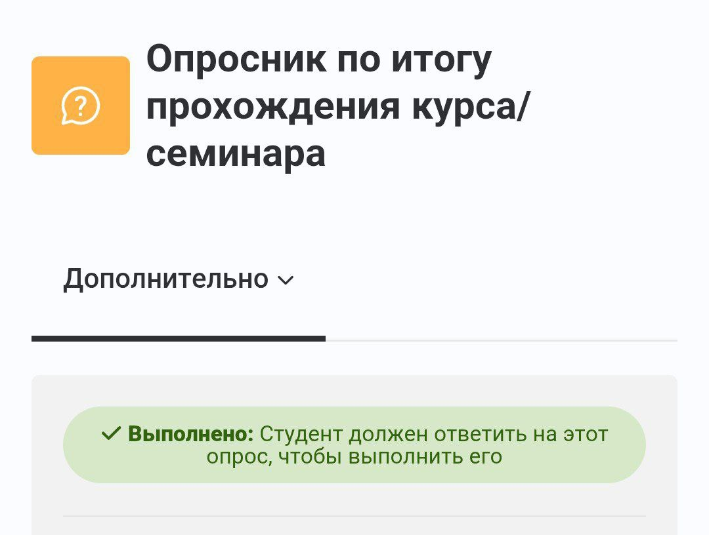

# PracticeFlutter

В рамках производственной практики, проходившей с 12.01.2026 по 15.02.2026 на предприятии AO "Неофлекс Консалдинг", мной, студентом группы 22290907/2091 ИСПО Бондаренко Георгием, был пройден курс по фреймворку Flutter и языку программирования Dart. Результаты проохождения курса представлены в этом репозитории.

## Результаты Итогового тестирования

## Опросник

